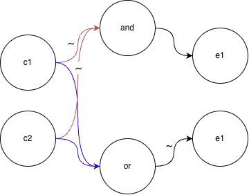
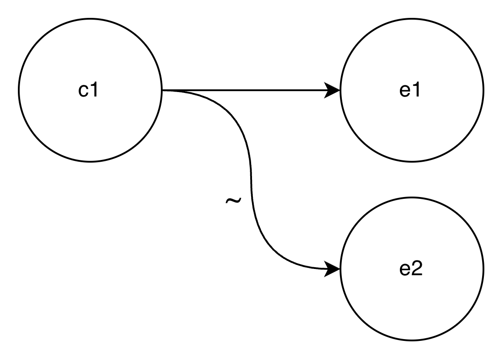

# 우아한 테크코스 첫번째 과제(문자열 덧셈 계산기)

## 목차
[순서도](#순서도수정)
 
[기능 목록](#기능-목록)
 
[세부기능 계획](#세부기능-계획)
 
[단위 테스트](#단위-테스트)

## 순서도(수정)

- 기존 순서도에 따른 로직의 문제점
  1. 계산항에서의 오류 구분의 모호성
     - 피연산항의 오류와 구분자의 오류를 구분하지 못하므로 에러의 통합이 필요
  2. 두 자리 이상의 피연산 항에 대해 구분자 오류로 인식하는 문제
     - 기존의 홀수항, 짝수항 검증 로직에서 구분자들로 구분하여 숫자를 판별하는 로직으로의 전환 필요
- 기존 테스트 코드 수정 필요 사항
  1. 시작 문자의 유효성 검증의 계산항의 피연산자 검증
  2. 시작 문자의 유효성 검증의 계산항의 구분자 검증
- 수정 후 목표 테스팅
  1.  두 자리수 이상의 덧셈연산 성공
  2.  피연산자와 구분자의 타당성 검증에서의 적절한 에러 발생 성공
- 빈 문자열 입력시에 0으로 간주하는 것에 대한 예외 처리 추가 요망
  1. ""입력시 0으로 출력하는 예외 로직 추가

## ~~순서도(이전)~~

## 기능 목록
~~ 0. 커스텀 에러 클래스 생성(CustomError)~~
1. 입력의 시작부분 검증(isStartCorrectly)
2. 입력 구분자의 유효성 검증(isValidSepInput)
3. 계산 항의 구분자와 숫자 유효성 검증(isValidSepAndOperand)
4. 숫자의 합 연산 후 출력(operationAndOutput)

## 세부기능 계획
### 0. 커스텀 에러 클래스 생성
1. 커스텀 에러 클래스는 에러 클래스를 상속받도록 한다.
2. 에러 발생 이유를 갖는 필드를 추가한다.

### 1. 입력의 시작 부분 검증
1. 입력에 대해서 특정 인덱스의 원소를 검사하여 유효성을 판단한다. 가령 [0], [1] 이 "//" 이거나 [0]이 숫자임을 검증한다.
2. 유효하지 않은 입력인 경우 사전에 제작한 에러 클래스를 통해 에러를 발생시키며, 에러가 발생된 이유도 필드에 추가한다.

### 2. 입력 구분자의 유효성 검증
1. 입력 구분자의 유효성을 검증한다. 이는 "//"로 시작한 경우에 호출된다.
2. 입력에 대해 [2]의 원소는 구분자로 입력 가능한 문자이며, [3:4]는 "\n" 문자열이어야 한다.

### 3. 계산 항의 구분자와 숫자 유효성 검증
~~1. 계산 항 왼쪽의 구분자 정의가 있다면 지운다.~~
~~2. 홀수 항이 모두 숫자인지를 검증한다.~~
~~3. 짝수 항이 모두 params에 포함된 구분자인지 검증한다.~~
1. 현재 식별된 구분자들로 입력에서의 피연산자들을 분리한다.
2. 분리된 피연산자가 숫자인지를 판별한다.
3. 구분자로 분리된 원소들이 모두 숫자가 아닌 경우 에러를 발생시킨다.

### 4. 숫자의 합을 연산 한 뒤 출력
1. 입력받은 구분자로 구분된 숫자들의 합을 연산한다.
2. 연산한 합을 출력한다.

## 단위 테스트
### isStartCorrectly
#### 역할
입력이 적절하게 시작하는지 검증하는 모듈이다.

#### 단위 모듈 목록
  - isValidStart

#### 원인 결과 그래프
c1. //로 시작하는 입력이다. 
c2. 숫자로 시작하는 입력이다.

e1. "[ERROR]: starting with invalid form" 출력한다. 
e2. 숫자 시작 여부 반환한다.

#### 테스트 입력 / 출력
"//123" / ~e2
"1,2,3" / ~e2
"&84" / e1

### isValidSepInput
#### 역할
적절한 길이를 갖고 있으며, 적절한 위치에 postfix가 있는가를 검증하는 모듈이다.

#### 단위 모듈 목록
  - isValidLength
  - isValidNewLine

#### isValidLength
##### 역할
입력이 5글자 초과인지 검증하는 모듈이다.

##### 원인 결과 그래프
c1. 5글자 이하의 입력  
e1. '[ERROR]: invalid sep or ender #1' 출력 
e2. pass

##### 테스트 입력 / 출력
"//12345" / e2 
"//12" / e1 
"//,\\\n" e1 

#### isValidNewLine
##### 역할
입력에 개행이 존재하며 적절한 위치에 있는가
##### 원인 결과 그래프
c1. 입력에 \\\n이 포함되어 있지 않다. 
e1. [ERROR]: invalid sep or ender #2 출력한다. 
e2. pass 

##### 테스트 입력 / 출력
"//,\\n1,2" / e2 
"//,1,2,3" / e1 

### isValidSepAndOperand
#### 역할
계산항의 피연산자와 구분자가 적절한지 검증한다.

#### 단위 모듈 목록
- getSplitter
  - escapeForCharClass
- isValidSep
- isValidSepOrChar

#### getSplitter
##### 역할
기본 구분자와 입력받은 구분자를 이용하여 계산항의 피연산자를 분리한 배열을 반환한다.

##### 원인 결과 그래프 생략
##### 테스트 입력(sep, input) / 출력
"", "1,2,3,4,5" / [1,2,3,4,5] 
":", "1:2:3:4:5" / [1,2,3,4,5] 
":", "1:2,3,4,5" / [1,2,3,4,5] 
~~ "", "" / [] ~~ 

#### isValidSep
##### 역할
피연산자들이 적절하게 구분자로 구분되었는지를 검증한다. 이는 구분자가 연속으로 오는 경우들을 예외처리할 수 있다.

##### 원인 결과 그래프 생략
##### 테스트 입력 / 출력
"['1', '2', '3']" / pass 
"['1', '', '4']" / [ERROR]: invalid operand or sep 

#### invalidSepOrChar
##### 역할
입력받은 문자열이 숫자인지 검증하는 모듈이다.

##### 원인 결과 그래프 생략
##### 테스트 입력
"1" / pass 
"12" / pass 
"123" / pass 
"abc" / [ERROR]: invalid operand or sep #3 